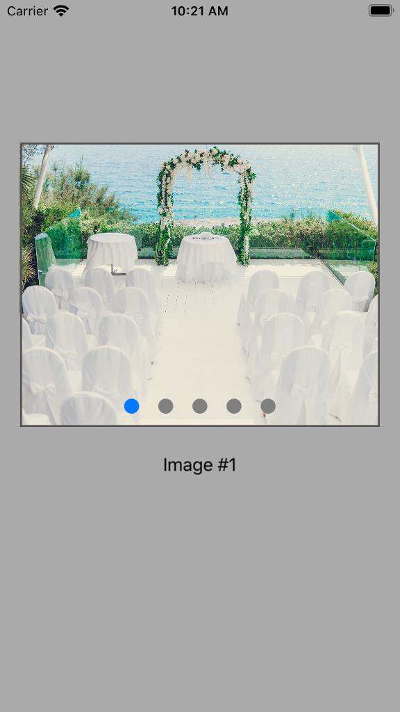

# ETCarouSwift

A user-friendly and developer-friendly carousel framework. ETCarouSwift receives a bunch of images and creates a smooth infinite ride inside the given frame. Dragging is also avaliable along with other handy settings. Simple, light and flawless.

## Demo

Click on the screnshot to try an interactive demo by [appetize.io](https://appetize.io)

[](https://appetize.io/app/an0dku1e08nm2kv7p8984cyqx8?device=iphone8&scale=75&orientation=portrait&osVersion=13.3)


## Requirements

* iOS 13.0+
* XCode 11.3


## Installation

### CocoaPods

You can use [CocoaPods](https://cocoapods.org) to install ```ETCarouSwift``` by adding it to your ```Podfile```:

```
# Pods for YourProject

   pod 'ETCarouSwift'
```

### Manually

1. Download ```ETCarouSwiftDemo```
2. Drag ```ETCarouSwift.framework``` to the root of Your Project
3. Don't forget to check ```copy items if needed```
4. Enjoy

Or

1. Download ```ETCarouSwift``` repo
2. Copy ```ETCarouSwift``` folder into YourProject
3. That's it


## Usage

### Get started

To get the full benefits import ```ETCarouSwift```  wherever you import UIKit

```Swift
import UIKit
import ETCarouSwift 
```

Initialize ```CarouView``` with desired frame and bunch of images. Set ```rideDirection``` as well if needed. Default is ```.rightToLeft```:

```Swift
let images:[UIImage] = [UIImage(named: "1")!,
                        UIImage(named: "2")!,
                        UIImage(named: "3")!,
                        UIImage(named: "4")!,
                        UIImage(named: "5")!]
                        
 let frame = CGRect(x: 10, y: 100, width: 300, height: 200)
 
 let carouView = CarouView(frame: frame, imageSet: images, rideDirection: .leftToRight)
```

Add ```CarouView``` to the main view:

```Swift
self.view.addSubview(carouView)
```

### Settings

1. AutoRide is enabled by default. If you want to cancel it:
```Swift
carouView.autoRideEnabled = false
```
2. Page indicator dot color & current dot color:
```Swift
carouView.dotColor = UIColor.white
carouView.currentDotColor = UIColor.black
```
3. Dot size. Default is ```.small```
```Swift
carouView.dotSize = .medium
```
4. Show time. Default is 2 seconds. Relevant when autoRide is enabled. 
```Swift
carouView.showTime = 3.5
```

### Delegate

Make your controller an inheritor of ```CarouViewDelegate``` protocol:
```Swift
class ViewController:UIViewController, CarouViewDelegate {
```
Initialize you ```carouView``` delegate with your controller property:

```Swift
carouView.delegate = self
```

Use two delegate methods:

```Swift
func carouViewDidChangeImage(_ carouView: CarouView, index currentImageIndex: Int) {
        
    //Do something when image changed
        
}
```

```Swift
func carouView(_ carouView: CarouView, didTapImageAt index: Int) {
    
    //Do something on image tap
}
```

## Author

**Elena Slovushch**
* [@XPlace](https://www.xplace.com/il/en/u/paralel?omloc=us_en)
* [@LinkedIn](https://www.linkedin.com/in/elena-slovushch/)
* [@StackOverFlow](https://stackoverflow.com/users/4506863/elena?tab=profile)


## License

This project is licensed under the MIT License - see the [LICENSE.md](LICENSE.md) file for details
