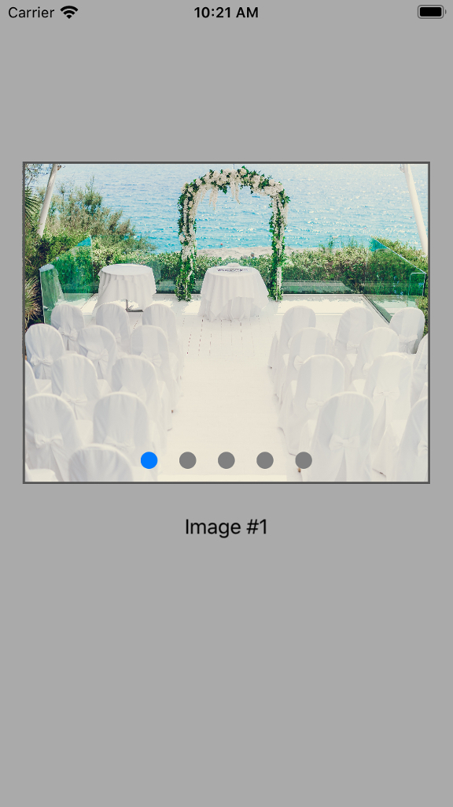

# ETCarouSwift

A user-friendly and developer-friendly carousel framework built with SwiftUI. ETCarouSwift receives a bunch of images and creates a smooth infinite ride inside the given frame. Dragging is also available along with other handy settings. Simple, light and flawless.

## Demo

Click on the screnshot to try an interactive demo by [appetize.io](https://appetize.io)

[](https://appetize.io/app/an0dku1e08nm2kv7p8984cyqx8?device=iphone8&scale=75&orientation=portrait&osVersion=13.3)


## Requirements

* iOS 13.0+
* Xcode 11.0+
* Swift 5.0+


## Installation

### CocoaPods

You can use [CocoaPods](https://cocoapods.org) to install ```ETCarouSwift``` by adding it to your ```Podfile```:

```
# Pods for YourProject

   pod 'ETCarouSwift'
```

### Manually

1. Download ```ETCarouSwiftDemo```
2. Drag ```ETCarouSwift.framework``` to the root of Your Project
3. Don't forget to check ```copy items if needed```
4. Enjoy

Or

1. Download ```ETCarouSwift``` repo
2. Copy ```ETCarouSwift``` folder into YourProject
3. That's it


## Usage

### Get started

Import ```ETCarouSwift``` and ```SwiftUI``` in your SwiftUI view:

```Swift
import SwiftUI
import ETCarouSwift
```

Initialize ```CarouView``` with a bunch of images. Set ```rideDirection``` as well if needed. Default is ```.rightToLeft```:

```Swift
struct ContentView: View {
    let images: [UIImage] = [
        UIImage(named: "1")!,
        UIImage(named: "2")!,
        UIImage(named: "3")!,
        UIImage(named: "4")!,
        UIImage(named: "5")!
    ]
    
    var body: some View {
        CarouView(
            imageSet: images,
            rideDirection: .rightToLeft
        )
        .frame(height: 300)
    }
}
```

### Settings

All settings can be configured during initialization:

1. **AutoRide** is enabled by default. To disable it:
```Swift
CarouView(
    imageSet: images,
    autoRideEnabled: false
)
```

2. **Page indicator dot color & current dot color**:
```Swift
CarouView(
    imageSet: images,
    dotColor: .white,
    currentDotColor: .black
)
```

3. **Dot size**. Default is ```.small```. Options: ```.small```, ```.medium```, ```.large```
```Swift
CarouView(
    imageSet: images,
    dotSize: .medium
)
```

4. **Show time**. Default is 2 seconds. Relevant when autoRide is enabled:
```Swift
CarouView(
    imageSet: images,
    showTime: 3.5
)
```

### Callbacks

Use closures to handle image changes and taps:

```Swift
CarouView(
    imageSet: images,
    onImageChanged: { index in
        print("Image changed to index: \(index)")
        // Do something when image changed
    },
    onImageTapped: { index in
        print("Image tapped at index: \(index)")
        // Do something on image tap
    }
)
```

### Complete Example

```Swift
import SwiftUI
import ETCarouSwift

struct ContentView: View {
    @State private var currentImageIndex: Int = 0
    
    let images: [UIImage] = [
        UIImage(named: "1")!,
        UIImage(named: "2")!,
        UIImage(named: "3")!,
        UIImage(named: "4")!,
        UIImage(named: "5")!
    ]
    
    var body: some View {
        VStack {
            CarouView(
                imageSet: images,
                rideDirection: .rightToLeft,
                autoRideEnabled: true,
                showTime: 2.0,
                dotColor: .gray,
                currentDotColor: .blue,
                dotSize: .medium,
                onImageChanged: { index in
                    currentImageIndex = index
                },
                onImageTapped: { index in
                    print("Tapped image at index: \(index)")
                }
            )
            .frame(height: 300)
            
            Text("Image #\(currentImageIndex + 1)")
                .font(.headline)
        }
    }
}
```

### Using SwiftUI Images

You can also use SwiftUI's `Image` type directly:

```Swift
let swiftUIImageSet: [Image] = [
    Image("1"),
    Image("2"),
    Image("3")
]

CarouView(imageSet: swiftUIImageSet)
```

## Author

**Elena Slovushch**
* [@XPlace](https://www.xplace.com/il/en/u/paralel?omloc=us_en)
* [@LinkedIn](https://www.linkedin.com/in/elena-slovushch/)
* [@StackOverFlow](https://stackoverflow.com/users/4506863/elena?tab=profile)


## License

This project is licensed under the MIT License - see the [LICENSE.md](LICENSE.md) file for details
